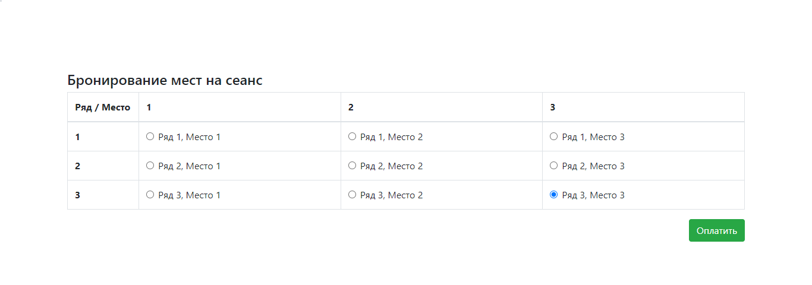
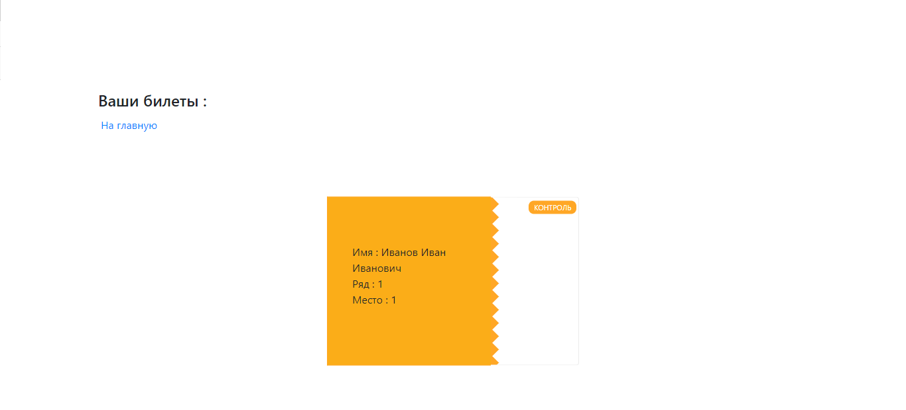

<h1>
job4j_cinema
</h1>

<h3>
Description :
</h3>

This project represent ticket purchase web-service 

<h4>
Used technologies :
</h4>
<ul>
<li>Servlets</li>
<li>JDBC</li>
<li>Slf4j</li>
<li>Checkstyle</li>
</ul>

Web-Service has a 3 screens

<ul>
<li>
Cinema hall schema. Reserved places cannot be selected
</li>
</ul>
<ul>

<li>
Payment form. Phone and email are unique for each user, 
data in this pair should not coincide with the data of another user 
</li>
</ul>

<ul>
<li>
Ticket with username and seat number
</li>
</ul>

<h3>
Configurations :
</h3>

To app boot is necessary use Apache Tomcat and edit run configuration. 
This configuration should have follow points : 

<ul>
<li>
'http://localhost:8080/cinema' as start page url;
</li>
<li>
'job4j_cinema:war exploded' as build artifact;
</li>
<li>
'/cinema' as application context
</li>
</ul>
<h3>Contact</h3>

If You have any question, please contact me:

https://t.me/roman_kozlov

